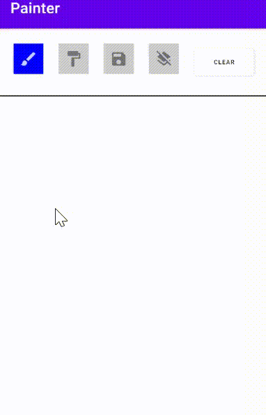

# Painter
[](https://jitpack.io/#gilglick/Painter)


Library for creating custom paints using custom drawer and alot of paint experience support, including bitmap export file. 
Draw & Have Fun!

## Setup
Step 1. Add it in your root 'build.gradle' to repositories:
```gradle
allprojects {
    repositories {
         ...
        maven { url 'https://jitpack.io' }
    }
}
```

Step 2. Add dependency:
```gradle
dependencies {
    ...
    implementation 'com.github.gilglick:Painter:1.0.1'
}
```


Step 3. Add the drawer holder componet to your XML:
```java
   <com.example.drawer.DrawerHolder
      android:id="@+id/drawHolder"
      android:layout_width="match_parent"
      android:layout_height="match_parent"/>
"/>

```

## ScreenShots 


## Usage

```java

        drawerHolder = findViewById(R.id.drawHolder);
        drawerHolder.register(bitmap -> {

        });              
```


## License

    Copyright 2020 Gil Glick

    Licensed under the Apache License, Version 2.0 (the "License");
    you may not use this file except in compliance with the License.
    You may obtain a copy of the License at

       http://www.apache.org/licenses/LICENSE-2.0

    Unless required by applicable law or agreed to in writing, software
    distributed under the License is distributed on an "AS IS" BASIS,
    WITHOUT WARRANTIES OR CONDITIONS OF ANY KIND, either express or implied.
    See the License for the specific language governing permissions and
    limitations under the License.

## Next Updates:
  -Preview Image
